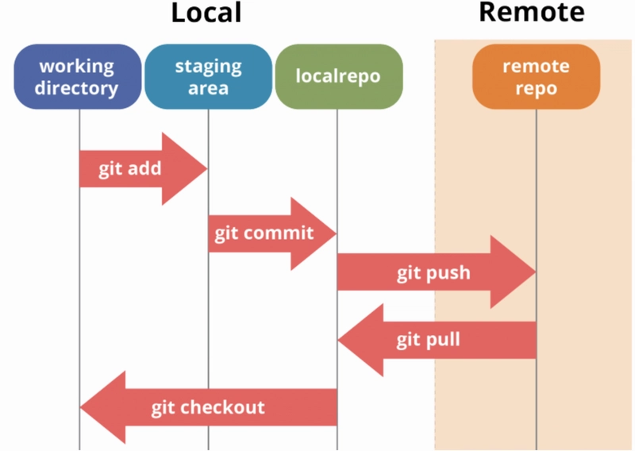

there are 2 way to pushing in github repository
1. **Creating a brand new repository**
2. **Pushing an existing local repository to GitHub**

Let’s explain **each line** step by step:

---

## 🔹 Create a new repository on the command line

```bash
echo "# learning_git" >> README.md
```

👉 Creates a file called `README.md` with the text `# learning_git` inside it.

```bash
git init
```

👉 Initializes a new Git repository in your current folder.

```bash
git add README.md
```

👉 Stages the `README.md` file so it’s ready to be committed.

```bash
git commit -m "first commit"
```

👉 Saves the staged file(s) to the repository history with the message `"first commit"`.

```bash
git branch -M main
```

👉 Renames the current branch to `main` (default branch on GitHub).

```bash
git remote add origin https://github.com/N4si/learning_git.git
```

👉 Links your local repo to the remote GitHub repo at the given URL.
(`origin` is just the name of this remote).

```bash
git push -u origin main
```

👉 Pushes your `main` branch to the remote `origin`.
The `-u` flag sets the upstream, so later you can just run `git push` without repeating branch/remote names.

---

## 🔹 Push an existing repository from the command line

```bash
git remote add origin https://github.com/N4si/learning_git.git
```

👉 Adds a remote connection to the GitHub repo.

```bash
git branch -M main
```

👉 Makes sure your branch is named `main`.

```bash
git push -u origin main
```

👉 Pushes all existing commits in your local repo to GitHub’s `main` branch and sets the upstream.

---

✅ In short:

* First block = if you are starting **from scratch**.
* Second block = if you already have a local repo and just want to connect it to GitHub.

---
---


# 🔄 Git Workflow (Step-by-Step)

```
                ┌─────────────┐
                │   Working   │
                │  Directory  │
                └─────┬───────┘
                      │
          (git add)   │
                      ▼
                ┌─────────────┐
                │   Staging   │
                │   Area      │
                └─────┬───────┘
                      │
       (git commit)   │
                      ▼
                ┌─────────────┐
                │   Local     │
                │ Repository  │
                └─────┬───────┘
                      │
   (git push origin)  │
                      ▼
                ┌─────────────┐
                │   Remote    │
                │ Repository  │
                │  (GitHub)   │
                └─────────────┘
```

---

# 📝 Commands in Each Step

1. **Working Directory → Staging Area**

   ```bash
   git add filename.txt
   git add .         # add all files
   ```

2. **Staging Area → Local Repository**

   ```bash
   git commit -m "commit message"
   ```

3. **Local Repository → Remote (GitHub)**

   ```bash
   git push origin main
   ```

4. **Remote → Local (if updates on GitHub)**

   ```bash
   git pull origin main
   ```

---

✅ This flow helps you remember:
**Edit → Add → Commit → Push → (Others Pull)**


